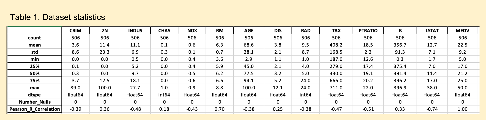
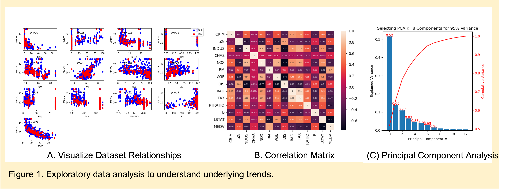

# Predict Housing Prices Using Advanced Regression Models
In this project I explored the Boston Housing Prices dataset from Kaggle [1] using advanced regression models. We 
perform various forms of feature extraction and data visualization to first understand the dataset. We then further
build on this work and considered the following model architectures: Linear Regression, SVR, Random Forest, XGBoost, 
GPR, and Artificial Neural Network. This work highlights the methods that can be in place for working with tabular 
datasets. This format can easily be adapted for other datasets or problem types (e.g. classification) as the steps are
well documented. Additionally, we highlight several additional techniques that can be used with larger datasets.
In general, given more complex problem domains, we can build customized solutions using more advanced methods. For
example, custom GPR Kernels using Gpy are available and can provide major benefits given the right implementation.

### Dataset Exploration

The first step in any machine learning project is to understand the data we are working with. We begin by first
investigating the statistics of our dataset to see the types of features we are dealing with and the ranges
we have. This gives us intuition on the type of model and data processing required. 

From [1] we see there are 13
variables of interest (columns 1-13) and one target variable we hope to predict (MEDV). The variables are defined as 
follows:  

    Inputs Features:
    CRIM: per capita crime rate by town
    ZN: proportion of residential land zoned for lots over 25,000 sq. ft.
    INDUS: proportion of non-retail buisness acres per town
    CHAS: Charles River dummy Variable (= 1 if tract bounds river; 0 otherwise)
    NOX: nitric oxides concentration (parts per 10 million)
    RM: averge number of rooms per dwelling
    AGE: proportion of owner-occupied units built prior to 1940
    DIS: weighted distances to five Boston employment centers
    RAD: index of accessibility to radial highways
    TAX: full-value property tax rate per $10K
    PTRATIO: pupil-teacher ratio by town
    B: 1000(Bk-0.63)2 where Bk is the proportion of blacks by town
    LSTAT: pct lower status of the population

    Output Feature:
    MEDV: medivan value of owner-occupied homes in $1000s

From Table 1 below we see basic statistics for each of our variables. In particular, we see there are no null values that
need to be adjusted for. It is clear that the mean of each variable is very different and thus some form of preprocessing
is preferred to allow for equal learning from featured inputs. Though we do not know the actual distribution of each of our 
featured inputs, looking at the data it seems that the standard normal distribution may not be the best assumption.
For example, the ZN variable has most our variance in the highest quartile of our dataset. Thus, we instead recommend
using standard 0-1 scaling for all our variables as the preprocessing. 

From Figure 1A below we can see the various linear relationships between our variables and the corresponding 
pearson r correlation coefficient. From here we see that two of our featured inputs have a very strong linear relationship
with our target variable: LSTAT (p=-0.74) and RM (p=0.7). The rest of our variables seem to have p values less than 
0.5 with weaker relationships. As a result, we don't expect our linear model to work off the bat. More complex relationships
need to be determined from other model structures. From Figure 1B, we can see the relationship between all our variables.
One important find from Figure 1B is that the DIS variable is highly correlated to several of our other variables such as 
NDUS, NOX, and AGE. For now we will keep this variable; however it may be worth further modeling to see if removing this variable
can reduce model complexity without impacting our performance. From Figure 1C we can infer that over half our variance can be
visualized using only our first principal component. And we can obtain 95% of our variance using only 8 components.

### Feature Selection

Write stuff here.

### Results

### Understanding this Git Repo
There are three main parts to the repo.
1. The main.py file is our centralized function that handles which models we end up running or the order of
evaluations.
   
2. The *models* folder is where we store each of our individual model implemenations. Details of hyper-parameter
tuning to plotting conditions can all be found here. Inside this folder we have a model_helper_fxns.py file which
   holds all our centralized functions that are used in all models.
   
3. The *dataset* folder is where we store both the dataset as well as the dataset preprocessing functions. In particular
we handle the dataset preprocessing (scaling, loading) and feature extraction in this area.

### References  
[1] https://www.kaggle.com/datasets/fedesoriano/the-boston-houseprice-data?resource=download  
[2] https://scikit-learn.org/stable/modules/feature_selection.html
